ELSA_GDGTS_r
================
Paul Zander
2023-12-20

This file contains code to produce plots and calculate statistics
related to the publication Zander et al., 2023 (Climate of the Past,
<https://doi.org/10.5194/egusphere-2023-1960>). Any use of data and
plots should cite the related publication.

This file contains additional plots and analyses not included in the
final manuscript. A small note: Throughout I use periods (.) in place of
apostrophes (‘) when naming GDGT compounds. So if you see IIIa.. that
means IIIa’’.

## Load Packages

``` r
setwd(dirname(rstudioapi::getActiveDocumentContext()$path))
Sys.setenv(LANGUAGE = "en")
# Check and install pacman if neccesary
if (!require("pacman")) {
  install.packages("pacman")
  library(pacman)
}
```

    ## Loading required package: pacman

``` r
# Load libraries
# these turned off for knitting
# remotes::install_github("AThibault92/paleoFROG")
# remotes::install_github("nickmckay/geoChronR")
pacman::p_load(
  ggplot2,
  tidyverse,
  paleoFROG,
  ggpmisc,
  matrixStats,
  BINCOR,
  tseries,
  ggforce,
  grid,
  parsnip,
  workflows,
  ranger,
  tidymodels,
  factoextra,
  tidyr,
  gridExtra,
  khroma,
  psych,
  geoChronR,
  compositions,
  pastclim,
  palinsol,
  RColorBrewer,
  car,
  PerformanceAnalytics
)
```

    ## Welcome to geoChronR version 1.1.10!

``` r
source("bayRmbt_predict.R")
source("bayRmbt_forward.R")
```

## Load data

``` r
gdgts_modern <- read.csv("ELSA_GDGTs_modern.csv")
colnames(gdgts_modern)[15:20] <-
  c("GDGT0", "GDGT1", "GDGT2", "GDGT3", "Cren", "Cren'")
gdgts_stack <- read.csv("ELSA_GDGTs_stack.csv")
colnames(gdgts_stack)[8:13] <-
  c("GDGT0", "GDGT1", "GDGT2", "GDGT3", "Cren", "Cren'")
gdgts_stack_with_slumps <- gdgts_stack
gdgts_stack <-
  filter(gdgts_stack, !(Sample_ID %in% c(
    350, 748, 749, 750, 800, 833, 940, 942, 945, 955
  )))

#oxygen data
SM_O2 <- read.csv("oxygendataSirocko2012.csv")
SM_O2 <- SM_O2[, 3:4]

#Tempdata
SM_temp <- read.csv("tempdataSirocko2012.csv")

# cru_ts4.01 monthly temperature data from 1901-2016, altitude 350 m
month_temp <- read.csv("monthly_means1901-2016_CRUTS.csv")

XRF <- read.csv("ELSA_XRF_composite_07.05.2023.csv")
ELSA_20_Corg <- read.csv("ELSA_20_Corg.csv")
## pollen data
pollen <- read.csv("ELSA_stack_pollen_Sirocko2022.csv")
pollen$Tree.Pollen <- as.numeric(pollen$Tree.Pollen)
pollen <-
  filter(pollen, is.na(Tree.Pollen) != TRUE)

#ice cores
NGRIP <- read.csv("./external_data/NGRIP_from_sirocko.csv")
NGRIP <- na.omit(NGRIP)

EPICA <- read.csv("./external_data/EPICA_temp_Jouzel_2007.csv")
EPICA$Age_b2k <- EPICA$Age..cal.BP. + 50
EPICA_CO2 <- read.csv("./external_data/EPICA_CO2_Bereiter2015.csv")
EPICA_CO2$Age_b2k <- EPICA_CO2$age_gas_calBP + 50

### d15N Greenland ice core temperature composite
NGRIP_temp_d15N <-
  read.csv("./external_data/Greenland_Temps/NGRIP_temp_Kindler_2014.csv")
GISP_temp_hol <-
  read.csv("./external_data/Greenland_Temps/GISP2_temp_Kobashi_2017.csv")
Greenland_temp <-
  data.frame(
    Age_b2k = c(GISP_temp_hol[GISP_temp_hol$age_GICC05 <= 10000,]$age_GICC05 +
                  50, NGRIP_temp_d15N[NGRIP_temp_d15N$ageGICC05 >= 10000,]$ageGICC05 + 50),
    temp =  c((GISP_temp_hol[GISP_temp_hol$age_GICC05 <= 10000,]$temp - (
      mean(GISP_temp_hol[GISP_temp_hol$age_GICC05 >= 9965,]$temp) - mean(NGRIP_temp_d15N[NGRIP_temp_d15N$ageGICC05 <=
                                                                                           11580,]$temp)
    )), NGRIP_temp_d15N[NGRIP_temp_d15N$ageGICC05 >= 10000,]$temp)
  )

#other external data
insol_berger <-
  read.csv("./external_data/Insolation_Berger1991/insol_100kyr.csv")
MD01_2444_SST <-
  read.csv("./external_data/MD01-2444_SST_Martrat2007/MD01-2444_SST.csv")
loess_temp <-
  read.csv("./external_data/Prudhomme2022_loess/Prudhomme2022_Temps.csv")
AMOC <-
  read.csv("./external_data/AMOC_Boehm2015/AMOC_boehm2015.csv")

insol_La04 <- read.csv("./external_data/Insol_La04.csv")
insol_La04$age_b2k <- -insol_La04$kyr * 1000
insol_La04$seasonal_gradient <-
  insol_La04$Insol_June_50N - insol_La04$Insol_Dec_50N

Raberg_22 <- read.csv("./external_data/Raberg22_GDGT_data.csv")
```

## Raberg22 dataaset exploration

``` r
Raberg_22_lakes <-
  filter(Raberg_22,
         Sample.group == "Lacustrine",
         Sample.subtype == "Surface Sediment")
Raberg_22_lakes$sumIIIa_div_sumIIa <-
  (Raberg_22_lakes$fIIIa + Raberg_22_lakes$fIIIa.) / (Raberg_22_lakes$fIIa + Raberg_22_lakes$fIIa.)
plot(Raberg_22_lakes$sumIIIa_div_sumIIa, Raberg_22_lakes$MAF)
```

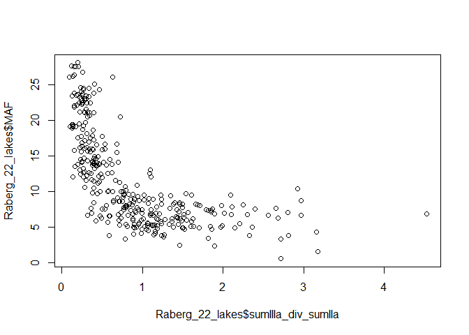<!-- -->

``` r
#Raberg 2021 equation
Raberg_22_lakes$fIb_meth <-
  Raberg_22_lakes$fIb / (Raberg_22_lakes$fIb + Raberg_22_lakes$fIIb + Raberg_22_lakes$fIIIb)
Raberg_22_lakes$fIIa_meth <-
  
  Raberg_22_lakes$fIIa / (Raberg_22_lakes$fIa + Raberg_22_lakes$fIIa + Raberg_22_lakes$fIIIa)
Raberg_22_lakes$fIIb_meth <-
  Raberg_22_lakes$fIIb / (Raberg_22_lakes$fIb + Raberg_22_lakes$fIIb + Raberg_22_lakes$fIIIb)
Raberg_22_lakes$fIIc_meth <-
  Raberg_22_lakes$fIIc / (Raberg_22_lakes$fIc + Raberg_22_lakes$fIIc + Raberg_22_lakes$fIIIc)
Raberg_22_lakes$fIIIa_meth <-
  Raberg_22_lakes$fIIIa / (Raberg_22_lakes$fIa + Raberg_22_lakes$fIIa + Raberg_22_lakes$fIIIa)
Raberg_22_lakes$fIIIb_meth <-
  Raberg_22_lakes$fIIIb / (Raberg_22_lakes$fIb + Raberg_22_lakes$fIIb + Raberg_22_lakes$fIIIb)
Raberg_22_lakes$TMAF_lake_Raberg21 <-
  92.9 + 63.84 * Raberg_22_lakes$fIb_meth ^ 2 -
  130.51 * Raberg_22_lakes$fIb_meth -
  28.77 * Raberg_22_lakes$fIIa_meth ^ 2 -
  72.28 * Raberg_22_lakes$fIIb_meth ^ 2 -
  5.88 * Raberg_22_lakes$fIIc_meth ^ 2 +
  20.89 * Raberg_22_lakes$fIIIa_meth ^ 2 -
  40.54 * Raberg_22_lakes$fIIIa_meth -
  80.47 * Raberg_22_lakes$fIIIb_meth
```

## Calculate indices and Temperatures on modern samples

``` r
#lake calibrations
gdgts_modern$MBT5Me <-
  (gdgts_modern$fIa + gdgts_modern$fIb + gdgts_modern$fIc) / (
    gdgts_modern$fIa + gdgts_modern$fIb + gdgts_modern$fIc + gdgts_modern$fIIa +
      gdgts_modern$fIIb + gdgts_modern$fIIc + gdgts_modern$fIIIa
  )
# calculate BAYMBT output
modern_bayMBT_lake_ens <-
  bayrmbt_predict(
    gdgts_modern$MBT5Me,
    prior_mean = 9.5,
    prior_std = 10,
    Tmodel = "T0",
    Type = "lake"
  )
gdgts_modern$BAYMBT_lake_TMAF_MartínezSosa21 <-
  modern_bayMBT_lake_ens[["T"]][, 2]
#Russell 2018 equations
gdgts_modern$Index1 <-
  log10((
    gdgts_modern$fIa + gdgts_modern$fIb + gdgts_modern$fIc + gdgts_modern$fIIa. + gdgts_modern$fIIIa.
  ) / (
    gdgts_modern$fIc + gdgts_modern$fIIa + gdgts_modern$fIIc + gdgts_modern$fIIIa +
      gdgts_modern$fIIIa.
  )
  )
gdgts_modern$Index1_lake_MAAT_Russell18 <-
  gdgts_modern$Index1 * 18.79 + 12.22
gdgts_modern$SFS_lake_MAAT_Russell18 <-
  23.81 - 31.02 * gdgts_modern$fIIIa - 41.91 * gdgts_modern$fIIb - 51.59 *
  gdgts_modern$fIIb. - 24.70 * gdgts_modern$fIIa + 68.80 * gdgts_modern$fIb
#Raberg 2021 equation
gdgts_modern$fIb_meth <-
  gdgts_modern$Ib / (gdgts_modern$Ib + gdgts_modern$IIb + gdgts_modern$IIIb)
gdgts_modern$fIIa_meth <-
  gdgts_modern$IIa / (gdgts_modern$Ia + gdgts_modern$IIa + gdgts_modern$IIIa)
gdgts_modern$fIIb_meth <-
  gdgts_modern$IIb / (gdgts_modern$Ib + gdgts_modern$IIb + gdgts_modern$IIIb)
gdgts_modern$fIIc_meth <-
  gdgts_modern$IIc / (gdgts_modern$Ic + gdgts_modern$IIc + gdgts_modern$IIIc)
gdgts_modern$fIIIa_meth <-
  gdgts_modern$IIIa / (gdgts_modern$Ia + gdgts_modern$IIa + gdgts_modern$IIIa)
gdgts_modern$fIIIb_meth <-
  gdgts_modern$IIIb / (gdgts_modern$Ib + gdgts_modern$IIb + gdgts_modern$IIIb)
gdgts_modern$TMAF_lake_Raberg21 <-
  92.9 + 63.84 * gdgts_modern$fIb_meth ^ 2 -
  130.51 * gdgts_modern$fIb_meth -
  28.77 * gdgts_modern$fIIa_meth ^ 2 -
  72.28 * gdgts_modern$fIIb_meth ^ 2 -
  5.88 * gdgts_modern$fIIc_meth ^ 2 +
  20.89 * gdgts_modern$fIIIa_meth ^ 2 -
  40.54 * gdgts_modern$fIIIa_meth -
  80.47 * gdgts_modern$fIIIb_meth

#soil calibrations
gdgts_modern$MBT5Me_soil_MAAT_DeJonge14 <-
  -8.57 + 31.45 * gdgts_modern$MBT5Me
gdgts_modern$Index1_soil_MAAT_DeJonge14 <-
  5.05 + 14.86 * gdgts_modern$Index1

modern_bayMBT_soil_ens <-
  bayrmbt_predict(
    gdgts_modern$MBT5Me,
    prior_mean = 9.5,
    prior_std = 10,
    Tmodel = "T0",
    Type = "soil"
  )
gdgts_modern$BAYMBT_soil_TMAF_CramptonFlood20 <-
  modern_bayMBT_soil_ens[["T"]][, 2]

# paleoFROG::run_app()
# Note, ran Paleofrog through shiny app, must input data in separate file. Paleofrog automatically recalculates fractions with the set they use. Run all models
paleoFROG_results_modern <-
  read.csv("paleofrog_ELSA_modern_model_results.csv")
gdgts_modern$paleoFROG0_soil_TMAF <- paleoFROG_results_modern$FROG0
gdgts_modern$paleoFROG_soil_MAAT <- paleoFROG_results_modern$FROG

#isoprenoidal indices
gdgts_modern$BIT <-
  (
    gdgts_modern$Ia + gdgts_modern$Ib + gdgts_modern$Ic + gdgts_modern$IIa +
      gdgts_modern$IIa. + gdgts_modern$IIb + gdgts_modern$IIb. + gdgts_modern$IIc +
      gdgts_modern$IIc. + gdgts_modern$IIIa + gdgts_modern$IIIa. + gdgts_modern$IIIb +
      gdgts_modern$IIIb.
  ) / (
    gdgts_modern$Ia + gdgts_modern$Ib + gdgts_modern$Ic + gdgts_modern$IIa +
      gdgts_modern$IIa. + gdgts_modern$IIb + gdgts_modern$IIb. + gdgts_modern$IIc +
      gdgts_modern$IIc. + gdgts_modern$IIIa + gdgts_modern$IIIa. + gdgts_modern$IIIb +
      gdgts_modern$IIIb. + gdgts_modern$Cren
  )

gdgts_modern$MI <-
  (gdgts_modern$GDGT1 + gdgts_modern$GDGT2 + gdgts_modern$GDGT3) / (
    gdgts_modern$GDGT1 + gdgts_modern$GDGT2 + gdgts_modern$GDGT3 + gdgts_modern$Cren + gdgts_modern$`Cren'`
  )

gdgts_modern$TEX86 <-
  (gdgts_modern$GDGT2 + gdgts_modern$GDGT3 + gdgts_modern$`Cren'`) / (gdgts_modern$GDGT1 +
                                                                        gdgts_modern$GDGT2 + gdgts_modern$GDGT3 + gdgts_modern$`Cren'`)
gdgts_modern$LST_powers2010 <- 55.231 * gdgts_modern$TEX86 - 13.955
gdgts_modern$GDGT0_index <-
  gdgts_modern$GDGT0 / (gdgts_modern$GDGT0 + gdgts_modern$Cren)

#elevation corrected temperatures using lapse rate from station data. Cruts pixel has average elevation of 350 m
alt_corr_month_temp <-
  data.frame(
    AU = month_temp$x - ((456 - 350) * 0.0066),
    GM = month_temp$x - ((407 - 350) * 0.0066),
    WM = month_temp$x - ((484 - 350) * 0.0066),
    HM = month_temp$x - ((425 - 350) * 0.0066),
    SM = month_temp$x - ((420 - 350) * 0.0066)
  )
TMAF <- colMeans(alt_corr_month_temp[2:12, ])
MAAT <- colMeans(alt_corr_month_temp)

gdgts_modern$CRUTS_MAAT_alt_corr <-
  MAAT[as.character(gdgts_modern$Site_ID)]

gdgts_modern$CRUTS_TMAF_alt_corr <-
  TMAF[as.character(gdgts_modern$Site_ID)]

gdgts_modern_sub <-
  gdgts_modern #this is an artefect of when I had AU data in the modern CSV, but its been removed now, so this is just a branchoff copy now.

gdgts_modern_temp_estimates <-
  select(
    gdgts_modern_sub,
    BAYMBT_lake_TMAF_MartínezSosa21,
    Index1_lake_MAAT_Russell18,
    SFS_lake_MAAT_Russell18,
    TMAF_lake_Raberg21,
    MBT5Me_soil_MAAT_DeJonge14,
    Index1_soil_MAAT_DeJonge14,
    BAYMBT_soil_TMAF_CramptonFlood20,
    paleoFROG0_soil_TMAF
  )

temp_offsets <-
  cbind(
    select(gdgts_modern_temp_estimates, contains("MAAT")) - gdgts_modern_sub$CRUTS_MAAT_alt_corr,
    select(gdgts_modern_temp_estimates, contains("TMAF")) - gdgts_modern_sub$CRUTS_TMAF_alt_corr,
    gdgts_modern_sub[37:56]
  )
```

## comparing distributions in soils and lake samples

``` r
#IIIa/IIa index
gdgts_modern_sub$sum_IIIa_div_IIa <-
  (gdgts_modern_sub$fIIIa + gdgts_modern_sub$fIIIa. + gdgts_modern_sub$fIIIa..) /
  (gdgts_modern_sub$fIIa + gdgts_modern_sub$fIIa.)
gdgts_modern_sub$iso_index <-
  (
    gdgts_modern_sub$fIIIa. + gdgts_modern_sub$fIIIb. +
      gdgts_modern_sub$fIIIc. + gdgts_modern_sub$fIIa. + gdgts_modern_sub$fIIb. +
      gdgts_modern_sub$fIIc.
  ) / (
    gdgts_modern_sub$fIIIa + gdgts_modern_sub$fIIa + gdgts_modern_sub$fIIIa. +
      gdgts_modern_sub$fIIIb. + gdgts_modern_sub$fIIIc. +
      gdgts_modern_sub$fIIa. + gdgts_modern_sub$fIIb. + gdgts_modern_sub$fIIc.
  )
gdgts_modern_sub$fIIIa..iso <-
  gdgts_modern_sub$IIIa.. / (gdgts_modern_sub$IIIa.. + gdgts_modern_sub$IIIa. +
                               gdgts_modern_sub$IIIa)

FA_names <-
  c(
    "fIIIa",
    "fIIIa.",
    "fIIIa..",
    "fIIIb",
    "fIIIb.",
    "fIIIc",
    "fIIIc.",
    "fIIa",
    "fIIa.",
    "fIIb",
    "fIIb.",
    "fIIc",
    "fIIc.",
    "fIa",
    "fIb",
    "fIc"
  )
modern_fractions_mean <-
  gdgts_modern_sub %>% group_by(Sample_type) %>% summarise_at(vars(all_of(FA_names)), list(Mean = mean))
modern_fractions_sd <-
  gdgts_modern_sub %>% group_by(Sample_type) %>% summarise_at(vars(all_of(FA_names)), list(sd = sd))

colnames(modern_fractions_mean)[-1] <- all_of(FA_names)
```

    ## Warning: Using `all_of()` outside of a selecting function was deprecated in tidyselect
    ## 1.2.0.
    ## ℹ See details at
    ##   <https://tidyselect.r-lib.org/reference/faq-selection-context.html>
    ## This warning is displayed once every 8 hours.
    ## Call `lifecycle::last_lifecycle_warnings()` to see where this warning was
    ## generated.

``` r
colnames(modern_fractions_sd)[-1] <- all_of(FA_names)

modern_fractions_mean_piv <-
  tidyr::pivot_longer(
    modern_fractions_mean,
    cols = all_of(FA_names),
    names_to = "FA",
    values_to = "mean"
  )
modern_fractions_sd_piv <-
  tidyr::pivot_longer(
    modern_fractions_sd,
    cols = all_of(FA_names),
    names_to = "FA",
    values_to = "sd"
  )
modern_fractions_sum_piv <-
  cbind(modern_fractions_mean_piv, sd = modern_fractions_sd_piv$sd)

ggplot(modern_fractions_sum_piv, aes(x = FA, y = mean, fill = Sample_type)) +
  geom_bar(position = position_dodge(),
           stat = "identity",
           colour = 'black') + theme_bw() +
  geom_errorbar(aes(ymin = mean - sd, ymax = mean + sd),
                width = .2,
                position = position_dodge(1))
```

<!-- -->

## Calculating some other indices on ELSA stack samples (sediment cores)

``` r
#calculating some indices on full stack
gdgts_stack$sum_IIIa_div_IIa <-
  (gdgts_stack$fIIIa + gdgts_stack$fIIIa. + gdgts_stack$fIIIa..) / (gdgts_stack$fIIa +
                                                                      gdgts_stack$fIIa.)
gdgts_stack$fIIIa..iso <-
  gdgts_stack$IIIa.. / (gdgts_stack$IIIa.. + gdgts_stack$IIIa + gdgts_stack$IIIa)
gdgts_stack$iso_index <-
  (
    gdgts_stack$fIIIa.  + gdgts_stack$fIIIb. + gdgts_stack$fIIIc. +
      gdgts_stack$fIIa. + gdgts_stack$fIIb. + gdgts_stack$fIIc.
  ) / (
    gdgts_stack$fIIIa + gdgts_stack$fIIa + gdgts_stack$fIIIb + gdgts_stack$fIIIc + gdgts_stack$fIIb +
      gdgts_stack$fIIc + gdgts_stack$fIIIa. +
      gdgts_stack$fIIIb. + gdgts_stack$fIIIc. + gdgts_stack$fIIa. + gdgts_stack$fIIb. +
      gdgts_stack$fIIc.
  )

gdgts_stack$BIT <-
  (
    gdgts_stack$Ia + gdgts_stack$Ib + gdgts_stack$Ic + gdgts_stack$IIa + gdgts_stack$IIa. +
      gdgts_stack$IIb + gdgts_stack$IIb. + gdgts_stack$IIc + gdgts_stack$IIc. +
      gdgts_stack$IIIa + gdgts_stack$IIIa. + gdgts_stack$IIIb + gdgts_stack$IIIb.
  ) / (
    gdgts_stack$Ia + gdgts_stack$Ib + gdgts_stack$Ic + gdgts_stack$IIa + gdgts_stack$IIa. +
      gdgts_stack$IIb + gdgts_stack$IIb. + gdgts_stack$IIc + gdgts_stack$IIc. +
      gdgts_stack$IIIa + gdgts_stack$IIIa. + gdgts_stack$IIIb + gdgts_stack$IIIb. +
      gdgts_stack$Cren
  )

gdgts_stack$MI <-
  (gdgts_stack$GDGT1 + gdgts_stack$GDGT2 + gdgts_stack$GDGT3) / (
    gdgts_stack$GDGT1 + gdgts_stack$GDGT2 + gdgts_stack$GDGT3 + gdgts_stack$Cren + gdgts_stack$`Cren'`
  )

gdgts_stack$soil_index <-
  (gdgts_stack$Ia + gdgts_stack$Ib + gdgts_stack$Ic + gdgts_stack$IIa) / (gdgts_stack$IIIa +
                                                                            gdgts_stack$IIIa. + gdgts_stack$IIIb + gdgts_stack$IIIb.)

gdgts_stack$TEX86 <-
  (gdgts_stack$GDGT2 + gdgts_stack$GDGT3 + gdgts_stack$`Cren'`) / (gdgts_stack$GDGT1 +
                                                                     gdgts_stack$GDGT2 + gdgts_stack$GDGT3 + gdgts_stack$`Cren'`)
gdgts_stack$LST_powers2010 <- 55.231 * gdgts_stack$TEX86 - 13.955
gdgts_stack$GDGT0 <- as.numeric(gdgts_stack$GDGT0)
gdgts_stack$GDGT0_index <-
  gdgts_stack$GDGT0 / (gdgts_stack$GDGT0 + gdgts_stack$Cren)
gdgts_stack[gdgts_stack$BIT > 0.6 |
              gdgts_stack$GDGT0_index > 0.5,]$LST_powers2010 <- NA
```

## Which GDGT FAs correlate with Corg/TChl?

``` r
ma <- function(x, n = 5) {
  stats::filter(x, rep(1 / n, n), sides = 2)
}
Corg_50yr <-
  as.data.frame(cbind(
    Age_b2k = ELSA_20_Corg$Age_b2k,
    Corg = ma(ELSA_20_Corg$Corg, n = 50)
  ))
Corg_interp <-
  as.data.frame(approx(
    Corg_50yr$Age_b2k,
    Corg_50yr$Corg,
    xout = as.numeric(gdgts_stack$Age_b2k)
  ))

FA_Corg_cor_15to60 <-
  cor((filter(gdgts_stack, Age_b2k > 15000) %>% select(all_of(FA_names))) , Corg_interp[Corg_interp$x >
                                                                                          15000, 2], method = "spearman")
barplot(
  height = FA_Corg_cor_15to60[, 1],
  names.arg = rownames(FA_Corg_cor_15to60),
  main = "15-60kyr"
)
```

<!-- -->

``` r
FA_Corg_cor <-
  cor((filter(gdgts_stack, Age_b2k > 0) %>% select(
    c(all_of(FA_names), "sum_IIIa_div_IIa", "fIIIa..iso")
  )) , Corg_interp[Corg_interp$x > 0, 2], method = "spearman")
barplot(height = FA_Corg_cor[, 1],
        names.arg = rownames(FA_Corg_cor),
        main = "0-60kyr")
```

<!-- -->

## Plotting temperature offsets

<!-- -->

## Plotting temperature offsets vs fIIIa’’

    ## `geom_smooth()` using formula = 'y ~ x'

<!-- -->

    ## `geom_smooth()` using formula = 'y ~ x'

<!-- -->

    ## `geom_smooth()` using formula = 'y ~ x'

    ## Warning: Removed 4 rows containing non-finite values (`stat_smooth()`).

    ## Warning: Removed 4 rows containing non-finite values (`stat_poly_eq()`).

    ## Warning: Removed 4 rows containing missing values (`geom_point()`).

<!-- -->

    ## `geom_smooth()` using formula = 'y ~ x'

    ## Warning: Removed 4 rows containing non-finite values (`stat_smooth()`).

    ## Warning: Removed 4 rows containing non-finite values (`stat_poly_eq()`).

    ## Warning: Removed 4 rows containing missing values (`geom_point()`).

<!-- -->

    ## `geom_smooth()` using formula = 'y ~ x'
    ## `geom_smooth()` using formula = 'y ~ x'

<!-- -->

    ## `geom_smooth()` using formula = 'y ~ x'
    ## `geom_smooth()` using formula = 'y ~ x'

<!-- -->

    ## `geom_smooth()` using formula = 'y ~ x'
    ## `geom_smooth()` using formula = 'y ~ x'

<!-- --><!-- -->

    ## Warning: Removed 12 rows containing missing values (`geom_point()`).

<!-- --><!-- -->

    ## `geom_smooth()` using formula = 'y ~ x'

<!-- -->

    ## `geom_smooth()` using formula = 'y ~ x'
    ## `geom_smooth()` using formula = 'y ~ x'
    ## `geom_smooth()` using formula = 'y ~ x'

<!-- -->

## Plot SM depth transect

    ## `geom_smooth()` using formula = 'y ~ x'

<!-- -->

## Corrections to calibration models using fIIIa’’

``` r
corr_model_Raberg21 <-
  lm(formula = TMAF_lake_Raberg21 ~ fIIIa..,
     data = filter(temp_offsets, Sample_type != "soil"))
summary(corr_model_Raberg21)
```

    ## 
    ## Call:
    ## lm(formula = TMAF_lake_Raberg21 ~ fIIIa.., data = filter(temp_offsets, 
    ##     Sample_type != "soil"))
    ## 
    ## Residuals:
    ##      Min       1Q   Median       3Q      Max 
    ## -1.00924 -0.38999 -0.09469  0.30276  2.72541 
    ## 
    ## Coefficients:
    ##             Estimate Std. Error t value Pr(>|t|)    
    ## (Intercept)   0.6538     0.2634   2.482   0.0183 *  
    ## fIIIa..     -51.3797     7.0634  -7.274  2.4e-08 ***
    ## ---
    ## Signif. codes:  0 '***' 0.001 '**' 0.01 '*' 0.05 '.' 0.1 ' ' 1
    ## 
    ## Residual standard error: 0.7535 on 33 degrees of freedom
    ## Multiple R-squared:  0.6159, Adjusted R-squared:  0.6042 
    ## F-statistic: 52.91 on 1 and 33 DF,  p-value: 2.403e-08

``` r
corr_model_BAYMBT_MartínezSosa21 <-
  lm(formula = BAYMBT_lake_TMAF_MartínezSosa21 ~ fIIIa..,
     data = filter(temp_offsets, Sample_type != "soil"))
summary(corr_model_BAYMBT_MartínezSosa21)
```

    ## 
    ## Call:
    ## lm(formula = BAYMBT_lake_TMAF_MartínezSosa21 ~ fIIIa.., data = filter(temp_offsets, 
    ##     Sample_type != "soil"))
    ## 
    ## Residuals:
    ##     Min      1Q  Median      3Q     Max 
    ## -1.7308 -0.5382 -0.1833  0.1774  3.6430 
    ## 
    ## Coefficients:
    ##             Estimate Std. Error t value Pr(>|t|)    
    ## (Intercept)   0.3763     0.3815   0.986    0.331    
    ## fIIIa..     -66.3943    10.2322  -6.489 2.31e-07 ***
    ## ---
    ## Signif. codes:  0 '***' 0.001 '**' 0.01 '*' 0.05 '.' 0.1 ' ' 1
    ## 
    ## Residual standard error: 1.092 on 33 degrees of freedom
    ## Multiple R-squared:  0.5606, Adjusted R-squared:  0.5473 
    ## F-statistic:  42.1 on 1 and 33 DF,  p-value: 2.306e-07

``` r
#### Function to correct temperatures based on linear model of fIIIa'' and modern temp offsets
temp_correction <- function(temp_calibration, temp_recon) {
  newdata <- select(temp_recon, paste(temp_calibration), fIIIa..)
  f <- as.formula(paste(temp_calibration, "fIIIa..", sep = "~"))
  
  corr_model <-
    lm(formula = f,
       data = filter(temp_offsets, Sample_type != "soil"))
  predicted_offset <- predict(corr_model, newdata = newdata)
  corrected_temps <- newdata[, 1] - predicted_offset
  return(corrected_temps)
}

# apply function to modern GDGT temperature estimates
gdgts_modern_temp_corrected <- gdgts_modern_temp_estimates
for (i in 1:ncol(gdgts_modern_temp_estimates)) {
  gdgts_modern_temp_corrected[, i] <-
    temp_correction(
      temp_calibration = colnames(gdgts_modern_temp_estimates[i]),
      temp_recon = gdgts_modern_sub
    )
}

colnames(gdgts_modern_temp_corrected) <-
  paste(colnames(gdgts_modern_temp_corrected), "_strat", sep = "")

#calculate offsets between modern temp and corrected data
corr_temp_offsets <-
  cbind(
    select(gdgts_modern_temp_corrected, contains("MAAT")) - gdgts_modern$CRUTS_MAAT_alt_corr,
    select(gdgts_modern_temp_corrected, contains("TMAF")) - gdgts_modern$CRUTS_TMAF_alt_corr,
    temp_offsets$Sample_type,
    temp_offsets$Sample_ID,
    temp_offsets$fIIIa..,
    temp_offsets$fIIIa..iso
  )

#plot corrected offsets like above
corr_temp_offsets_piv <-
  tidyr::pivot_longer(
    corr_temp_offsets,
    cols = c(
      MBT5Me_soil_MAAT_DeJonge14_strat,
      Index1_soil_MAAT_DeJonge14_strat,
      BAYMBT_soil_TMAF_CramptonFlood20_strat,
      paleoFROG0_soil_TMAF_strat,
      Index1_lake_MAAT_Russell18_strat,
      SFS_lake_MAAT_Russell18_strat,
      BAYMBT_lake_TMAF_MartínezSosa21_strat,
      TMAF_lake_Raberg21_strat
    ),
    names_to = "Temp_calibration"
  )

colnames(corr_temp_offsets_piv)[c(1:4)] <-
  c("Sample_type", "Sample_ID", "fIIIa..", "fIIIa..iso")

ggplot(
  corr_temp_offsets_piv,
  aes(
    x = forcats::as_factor(Temp_calibration),
    y = value,
    shape = Sample_type,
    fill = fIIIa..
  )
) +
  geom_jitter(size = 2, width = 0.3) +
  scale_shape_manual(values = c(21:24)) +
  scale_fill_continuous(type = "viridis") +
  theme_bw() +
  ggtitle("Corrected brGDGT Temperature Calibrations") +
  ylab("Offset from 1901-2016 Temperature (°C)") +
  ylim(-11, 11) +
  theme(axis.title.x = element_blank(),
        axis.text.x = element_text(angle = -45, hjust = 0))
```

<!-- -->

``` r
##### plot that combines corrected and uncorrected model offsets
temp_offsets_combo <-
  cbind(temp_offsets, corr_temp_offsets[, c(5, 6, 9, 10)], gdgts_modern_sub$MBT5Me)
colnames(temp_offsets_combo)[42] <- "MBT5Me"

#pivot
temp_offsets_combo_piv <-   tidyr::pivot_longer(
  temp_offsets_combo,
  cols = c(
    MBT5Me_soil_MAAT_DeJonge14,
    Index1_soil_MAAT_DeJonge14,
    BAYMBT_soil_TMAF_CramptonFlood20,
    paleoFROG0_soil_TMAF,
    Index1_lake_MAAT_Russell18,
    SFS_lake_MAAT_Russell18,
    BAYMBT_lake_TMAF_MartínezSosa21,
    TMAF_lake_Raberg21,
    BAYMBT_lake_TMAF_MartínezSosa21_strat,
    TMAF_lake_Raberg21_strat,
  ),
  names_to = "Temp_calibration"
)

ggplot(
  temp_offsets_combo_piv,
  aes(
    x = forcats::as_factor(Temp_calibration),
    y = value,
    shape = Sample_type,
    fill = fIIIa..
  )
) +
  geom_jitter(size = 2, width = 0.3) +
  scale_shape_manual(values = c(21:24)) +
  scale_fill_continuous(type = "viridis") +
  theme_bw() +
  ggtitle("brGDGT Temperature Calibrations") +
  ylab("Offset from 1901-2016 Temperature (°C)") +
  ylim(-11, 11) +
  theme(axis.title.x = element_blank(),
        axis.text.x = element_text(angle = -45, hjust = 0))
```

<!-- -->

## Calculate indices and Temperatures on ELSA stack samples

``` r
#lake calibrations
gdgts_stack$MBT5Me <-
  (gdgts_stack$fIa + gdgts_stack$fIb + gdgts_stack$fIc) / (
    gdgts_stack$fIa + gdgts_stack$fIb + gdgts_stack$fIc + gdgts_stack$fIIa +
      gdgts_stack$fIIb + gdgts_stack$fIIc + gdgts_stack$fIIIa
  )
# calculate BAYMBT output
stack_bayMBT_lake_ens <-
  bayrmbt_predict(
    gdgts_stack$MBT5Me,
    prior_mean = 9.5,
    prior_std = 10,
    Tmodel = "T0",
    Type = "lake"
  )
gdgts_stack$BAYMBT_lake_TMAF_MartínezSosa21 <-
  stack_bayMBT_lake_ens[["T"]][, 2]
#Russell 2018 equations
gdgts_stack$Index1 <-
  log10((
    gdgts_stack$fIa + gdgts_stack$fIb + gdgts_stack$fIc + gdgts_stack$fIIa. + gdgts_stack$fIIIa.
  ) / (
    gdgts_stack$fIc + gdgts_stack$fIIa + gdgts_stack$fIIc + gdgts_stack$fIIIa +
      gdgts_stack$fIIIa.
  )
  )
gdgts_stack$Index1_lake_MAAT_Russell18 <-
  gdgts_stack$Index1 * 18.79 + 12.22
gdgts_stack$SFS_lake_MAAT_Russell18 <-
  23.81 - 31.02 * gdgts_stack$fIIIa - 41.91 * gdgts_stack$fIIb - 51.59 *
  gdgts_stack$fIIb. - 24.70 * gdgts_stack$fIIa + 68.80 * gdgts_stack$fIb
#Raberg 2021 equation
gdgts_stack$fIb_meth <-
  gdgts_stack$Ib / (gdgts_stack$Ib + gdgts_stack$IIb + gdgts_stack$IIIb)
gdgts_stack$fIIa_meth <-
  gdgts_stack$IIa / (gdgts_stack$Ia + gdgts_stack$IIa + gdgts_stack$IIIa)
gdgts_stack$fIIb_meth <-
  gdgts_stack$IIb / (gdgts_stack$Ib + gdgts_stack$IIb + gdgts_stack$IIIb)
gdgts_stack$fIIc_meth <-
  gdgts_stack$IIc / (gdgts_stack$Ic + gdgts_stack$IIc + gdgts_stack$IIIc)
gdgts_stack$fIIIa_meth <-
  gdgts_stack$IIIa / (gdgts_stack$Ia + gdgts_stack$IIa + gdgts_stack$IIIa)
gdgts_stack$fIIIb_meth <-
  gdgts_stack$IIIb / (gdgts_stack$Ib + gdgts_stack$IIb + gdgts_stack$IIIb)
gdgts_stack$TMAF_lake_Raberg21 <-
  92.9 + 63.84 * gdgts_stack$fIb_meth ^
  2 -
  130.51 * gdgts_stack$fIb_meth -
  28.77 * gdgts_stack$fIIa_meth ^ 2 -
  72.28 * gdgts_stack$fIIb_meth ^ 2 -
  5.88 * gdgts_stack$fIIc_meth ^ 2 +
  20.89 * gdgts_stack$fIIIa_meth ^ 2 -
  40.54 * gdgts_stack$fIIIa_meth -
  80.47 * gdgts_stack$fIIIb_meth

#soil calibrations
gdgts_stack$MBT5Me_soil_MAAT_DeJonge14 <-
  -8.57 + 31.45 * gdgts_stack$MBT5Me
gdgts_stack$Index1_soil_MAAT_DeJonge14 <-
  5.05 + 14.86 * gdgts_stack$Index1

stack_bayMBT_soil_ens <-
  bayrmbt_predict(
    gdgts_stack$MBT5Me,
    prior_mean = 9.5,
    prior_std = 10,
    Tmodel = "T0",
    Type = "soil"
  )
gdgts_stack$BAYMBT_soil_TMAF_CramptonFlood20 <-
  stack_bayMBT_soil_ens[["T"]][, 2]

# Note, ran Paleofrog through shiny app, must input data in separate file. paleofrog recalculates fractions for the set it uses
# paleoFROG::run_app()
paleoFROG_results_stack <-
  read.csv("paleofrog_ELSA_stack_model_results.csv")

# #slump reomved version
paleoFROG_results_stack <-
  filter(paleoFROG_results_stack,!(ID %in% c(
    350, 748, 749, 750, 800, 833, 940, 942, 945, 955
  )))
gdgts_stack$paleoFROG0_soil_TMAF <- paleoFROG_results_stack$FROG0
gdgts_stack$paleoFROG_soil_MAAT <- paleoFROG_results_stack$FROG


#altitude correction
SMF_alt <- gdgts_stack %>%
  filter(Core_ID %in% c("SMF2", "SMF1")) %>%
  mutate_at(
    vars(
      MBT5Me_soil_MAAT_DeJonge14,
      Index1_soil_MAAT_DeJonge14,
      BAYMBT_soil_TMAF_CramptonFlood20,
      paleoFROG0_soil_TMAF,
      Index1_lake_MAAT_Russell18,
      SFS_lake_MAAT_Russell18,
      BAYMBT_lake_TMAF_MartínezSosa21,
      TMAF_lake_Raberg21,
      paleoFROG_soil_MAAT
    ),
    ~ . + ((456 - 456) * 0.0066)
  )

HM_alt <- gdgts_stack %>%
  filter(Core_ID %in% c("HM3", "HM4")) %>%
  mutate_at(
    vars(
      MBT5Me_soil_MAAT_DeJonge14,
      Index1_soil_MAAT_DeJonge14,
      BAYMBT_soil_TMAF_CramptonFlood20,
      paleoFROG0_soil_TMAF,
      Index1_lake_MAAT_Russell18,
      SFS_lake_MAAT_Russell18,
      BAYMBT_lake_TMAF_MartínezSosa21,
      TMAF_lake_Raberg21,
      paleoFROG_soil_MAAT
    ),
    ~ . + ((425 - 456) * 0.0066)
  )

gdgts_stack <-
  rbind(SMF_alt, HM_alt, filter(gdgts_stack, Core_ID %in% c("AU3", "AU4")))
```

## Plotting temperatures (without correction)

<!-- -->

## Corrections to reconstructions using fIIIa’’

<!-- --><!-- -->

    ## Scale for shape is already present.
    ## Adding another scale for shape, which will replace the existing scale.

    ## Warning: Removed 294 rows containing missing values (`geom_line()`).

    ## Warning: Removed 294 rows containing missing values (`geom_point()`).

    ## Warning: Removed 5797 rows containing missing values (`geom_line()`).

<!-- -->

    ## Scale for shape is already present.
    ## Adding another scale for shape, which will replace the existing scale.

    ## Warning: Removed 294 rows containing missing values (`geom_line()`).

    ## Warning: Removed 294 rows containing missing values (`geom_point()`).

    ## Warning: Removed 5797 rows containing missing values (`geom_line()`).

<!-- -->
\## PCA plotting

``` r
#wrangling data for PCA on full set, and Branched GDGTs
data_for_PCA <-
  rbind(select(
    gdgts_modern_sub,
    c(
      "GDGT0",
      "GDGT1",
      "GDGT2",
      "GDGT3",
      "Cren",
      "Cren'",
      "IIIa",
      "IIIa.",
      "IIIa..",
      "IIIb",
      "IIIb.",
      "IIIc",
      "IIIc.",
      "IIa",
      "IIa.",
      "IIb",
      "IIb.",
      "IIc",
      "IIc.",
      "Ia",
      "Ib",
      "Ic"
    )
  ), select(
    gdgts_stack,
    c(
      "GDGT0",
      "GDGT1",
      "GDGT2",
      "GDGT3",
      "Cren",
      "Cren'",
      "IIIa",
      "IIIa.",
      "IIIa..",
      "IIIb",
      "IIIb.",
      "IIIc" ,
      "IIIc.",
      "IIa",
      "IIa.",
      "IIb",
      "IIb.",
      "IIc",
      "IIc.",
      "Ia",
      "Ib",
      "Ic"
    )
  ))

brGDGTs_data <-
  select(
    data_for_PCA,
    c(
      "IIIa",
      "IIIa.",
      "IIIa..",
      "IIIb",
      "IIIb.",
      "IIIc" ,
      "IIIc.",
      "IIa",
      "IIa.",
      "IIb",
      "IIb.",
      "IIc",
      "IIc.",
      "Ia",
      "Ib",
      "Ic"
    )
  )

data_for_PCA <- data_for_PCA / rowSums(data_for_PCA)
sample_type_full <-
  c(gdgts_modern_sub$Sample_type, rep("lake_core", each = nrow(gdgts_stack)))
#adding site ids to core samples
sample_type_full_alt <- sample_type_full
for (i in 1:length(sample_type_full)) {
  if (sample_type_full[i] == "lake_core")
  {
    if (i < 49)
    {
      sample_type_full_alt[i] <-
        paste("core-", gdgts_modern_sub$Site_ID[i], sep = "")
    }
    else {
      sample_type_full_alt[i] <-
        paste("core-", gdgts_stack$Core_ID[i - 48], sep = "")
    }
  }
}
sample_type_full_alt <- gsub('[0-9]+', '', sample_type_full_alt)
sample_type_full_alt[sample_type_full_alt == "core-SMF"] <-
  "core-SM"

#alternate grouping
sample_type_full_alt2 <- sample_type_full_alt
sample_type_full_alt2[sample_type_full_alt == "core-AU"] <- "AU"
sample_type_full_alt2[sample_type_full_alt == "core-GM"] <- "GM"
sample_type_full_alt2[sample_type_full_alt == "core-SM"] <- "SM"
sample_type_full_alt2[which(gdgts_modern_sub$Site_ID == "SM" &
                              gdgts_modern_sub$Sample_type != "lake_shore")[1:nrow(gdgts_modern_sub)]] <-
  "SM"
sample_type_full_alt2[sample_type_full_alt == "core-HM"] <-
  "HM (>1000 yr b2k)"
sample_type_full_alt2[which(gdgts_modern_sub$Site_ID == "HM" &
                              gdgts_modern_sub$Sample_type != "lake_shore")[1:nrow(gdgts_modern_sub)]] <-
  "HM (<100 yr b2k)"
sample_type_full_alt2[sample_type_full_alt == "lake_shore"] <-
  "Lake shore (SM)"
sample_type_full_alt2[sample_type_full_alt == "soil"] <- "Soil"

sample_type_full_alt2 <-
  factor(
    sample_type_full_alt2,
    levels = c(
      "Soil",
      "Lake shore (SM)",
      "GM",
      "SM",
      "HM (<100 yr b2k)",
      "HM (>1000 yr b2k)",
      "AU"
    )
  )


Full_pca <- prcomp(clr(data_for_PCA), scale = TRUE)
summary(Full_pca)
```

    ## Importance of components:
    ##                           PC1    PC2    PC3    PC4     PC5     PC6     PC7
    ## Standard deviation     3.1121 1.7265 1.5820 1.3175 1.05537 0.93348 0.79292
    ## Proportion of Variance 0.4402 0.1355 0.1138 0.0789 0.05063 0.03961 0.02858
    ## Cumulative Proportion  0.4402 0.5757 0.6895 0.7684 0.81902 0.85863 0.88720
    ##                            PC8     PC9    PC10    PC11   PC12    PC13    PC14
    ## Standard deviation     0.75215 0.71067 0.56811 0.53031 0.4499 0.37100 0.35917
    ## Proportion of Variance 0.02571 0.02296 0.01467 0.01278 0.0092 0.00626 0.00586
    ## Cumulative Proportion  0.91292 0.93588 0.95055 0.96333 0.9725 0.97879 0.98465
    ##                           PC15    PC16    PC17    PC18    PC19    PC20    PC21
    ## Standard deviation     0.33584 0.24249 0.22281 0.21306 0.17679 0.15287 0.12816
    ## Proportion of Variance 0.00513 0.00267 0.00226 0.00206 0.00142 0.00106 0.00075
    ## Cumulative Proportion  0.98978 0.99245 0.99471 0.99677 0.99819 0.99925 1.00000
    ##                             PC22
    ## Standard deviation     4.076e-15
    ## Proportion of Variance 0.000e+00
    ## Cumulative Proportion  1.000e+00

``` r
#Plot full data PCA
plot_PCA1 <-
  fviz_pca_biplot(
    X = Full_pca,
    repel = TRUE,
    label = "var",
    habillage = as.factor(sample_type_full_alt2),
    geom.ind = "point",
    alpha.ind = 0.8,
    col.var = "black"
  )   +  theme(
    panel.grid.major = element_blank(),
    panel.grid.minor = element_blank(),
    panel.border = element_rect(
      colour = "black",
      fill = NA,
      size = 1
    )
  ) + scale_shape_manual(values = c(0, 2, 1, 1, 1, 1, 1)) + khroma::scale_color_bright()
```

    ## Warning: The `size` argument of `element_rect()` is deprecated as of ggplot2 3.4.0.
    ## ℹ Please use the `linewidth` argument instead.
    ## This warning is displayed once every 8 hours.
    ## Call `lifecycle::last_lifecycle_warnings()` to see where this warning was
    ## generated.

    ## Scale for shape is already present.
    ## Adding another scale for shape, which will replace the existing scale.

``` r
plot_PCA1.3 <-
  fviz_pca_biplot(
    X = Full_pca,
    repel = TRUE,
    label = "var",
    axes = c(3, 2),
    habillage = as.factor(sample_type_full_alt2),
    geom.ind = "point",
    alpha.ind = 0.8,
    col.var = "black"
  )   +  theme(
    panel.grid.major = element_blank(),
    panel.grid.minor = element_blank(),
    panel.border = element_rect(
      colour = "black",
      fill = NA,
      size = 1
    )
  ) + scale_shape_manual(values = c(0, 2, 1, 1, 1, 1, 1)) + khroma::scale_color_bright()
```

    ## Scale for shape is already present.
    ## Adding another scale for shape, which will replace the existing scale.

``` r
plot_PCA1.3
```

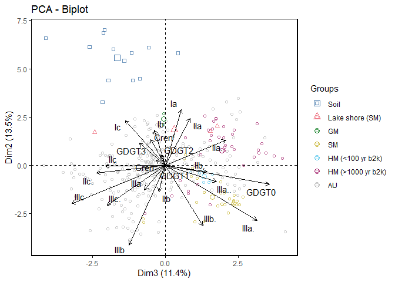<!-- -->

``` r
#Plot with temp_recon as shading
TMAF_temp <-
  rbind(
    select(gdgts_stack_corrected, Sample_ID, TMAF_lake_Raberg21),
    select(gdgts_stack_corrected_overlap, Sample_ID, TMAF_lake_Raberg21)
  )
TMAF_temp$Sample_ID <- as.numeric(TMAF_temp$Sample_ID)
TMAF_temp <- TMAF_temp[order(TMAF_temp$Sample_ID), ]
temp_raberg_strat_full <-
  c(
    gdgts_modern_temp_corrected$TMAF_lake_Raberg21_strat,
    TMAF_temp$TMAF_lake_Raberg21
  )

plot_PCA1.2 <-
  fviz_pca_biplot(
    X = Full_pca,
    repel = TRUE,
    label = "var",
    col.ind = temp_raberg_strat_full,
    geom.ind = "point",
    alpha.ind = 0.8,
    col.var = "black"
  )  + scale_shape_manual(values = c(21, 22, 23, 24)) +  theme(
    panel.grid.major = element_blank(),
    panel.grid.minor = element_blank(),
    panel.border = element_rect(
      colour = "black",
      fill = NA,
      size = 1
    )
  ) + scale_color_viridis_c(option = "A") + labs(color = "TMAF °C")
plot_PCA1.2
```

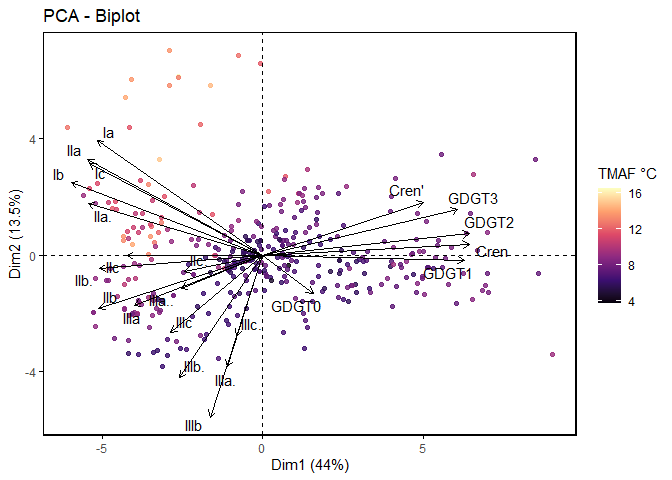<!-- -->

``` r
#plot branched only PCA
brGDGTs_data <- brGDGTs_data / rowSums(brGDGTs_data)
brGDGTs_pca <- prcomp(clr(brGDGTs_data), scale = TRUE)
print("brGDGTs PCA summary")
```

    ## [1] "brGDGTs PCA summary"

``` r
summary(brGDGTs_pca)
```

    ## Importance of components:
    ##                           PC1    PC2    PC3     PC4     PC5     PC6     PC7
    ## Standard deviation     2.3589 1.7251 1.3688 1.15708 1.01772 0.90752 0.81135
    ## Proportion of Variance 0.3478 0.1860 0.1171 0.08368 0.06473 0.05147 0.04114
    ## Cumulative Proportion  0.3478 0.5338 0.6509 0.73456 0.79929 0.85077 0.89191
    ##                            PC8     PC9    PC10    PC11    PC12    PC13    PC14
    ## Standard deviation     0.76127 0.58674 0.54131 0.47345 0.31346 0.27628 0.26113
    ## Proportion of Variance 0.03622 0.02152 0.01831 0.01401 0.00614 0.00477 0.00426
    ## Cumulative Proportion  0.92813 0.94965 0.96796 0.98197 0.98811 0.99288 0.99714
    ##                           PC15      PC16
    ## Standard deviation     0.21380 3.584e-15
    ## Proportion of Variance 0.00286 0.000e+00
    ## Cumulative Proportion  1.00000 1.000e+00

``` r
#PCs 1 and 2
plot_PCA2 <-
  fviz_pca_biplot(
    X = brGDGTs_pca,
    repel = TRUE,
    label = "var",
    habillage = as.factor(sample_type_full_alt2),
    geom.ind = "point",
    alpha.ind = 0.8,
    col.var = "black"
  )  +    theme(
    panel.grid.major = element_blank(),
    panel.grid.minor = element_blank(),
    panel.border = element_rect(
      colour = "black",
      fill = NA,
      size = 1
    )
  ) + scale_shape_manual(values = c(0, 2, 1, 1, 1, 1, 1)) + khroma::scale_color_bright()
```

    ## Scale for shape is already present.
    ## Adding another scale for shape, which will replace the existing scale.

``` r
plot_PCA2
```

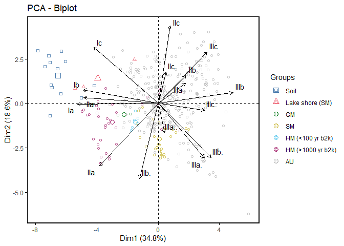<!-- -->

``` r
#PCs 2 and 3
plot_PCA3 <-
  fviz_pca_biplot(
    X = brGDGTs_pca,
    axes = c(3, 2),
    repel = TRUE,
    label = "var",
    habillage = as.factor(sample_type_full_alt2),
    geom.ind = "point",
    alpha.ind = 0.8,
    col.var = "black"
  )  +    theme(
    panel.grid.major = element_blank(),
    panel.grid.minor = element_blank(),
    panel.border = element_rect(
      colour = "black",
      fill = NA,
      size = 1
    )
  ) + scale_shape_manual(values = c(0, 2, 1, 1, 1, 1, 1)) + khroma::scale_color_bright()
```

    ## Scale for shape is already present.
    ## Adding another scale for shape, which will replace the existing scale.

``` r
plot_PCA3
```

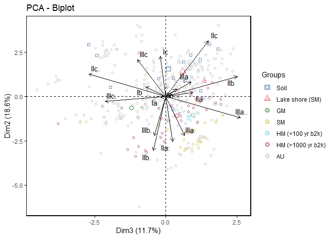<!-- -->

``` r
plot_PCA3b <-
  fviz_pca_biplot(
    X = brGDGTs_pca,
    axes = c(3, 2),
    repel = TRUE,
    label = "var",
    col.ind = temp_raberg_strat_full,
    geom.ind = "point",
    alpha.ind = 0.8,
    col.var = "black"
  )   + scale_shape_manual(values = c(21, 22, 23, 24)) +  theme(
    panel.grid.major = element_blank(),
    panel.grid.minor = element_blank(),
    panel.border = element_rect(
      colour = "black",
      fill = NA,
      size = 1
    )
  ) + scale_color_viridis_c(option = "A") + labs(color = "TMAF °C")
plot_PCA3b
```

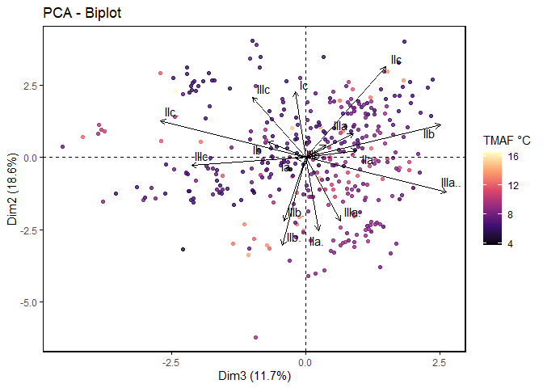<!-- -->

``` r
plot_PCA4 <-
  fviz_pca_biplot(
    X = brGDGTs_pca,
    repel = TRUE,
    label = "var",
    col.ind = temp_raberg_strat_full,
    geom.ind = "point",
    alpha.ind = 0.8,
    col.var = "black"
  )   + scale_shape_manual(values = c(21, 22, 23, 24)) +  theme(
    panel.grid.major = element_blank(),
    panel.grid.minor = element_blank(),
    panel.border = element_rect(
      colour = "black",
      fill = NA,
      size = 1
    )
  ) + scale_color_viridis_c(option = "A") + labs(color = "TMAF °C")
plot_PCA4
```

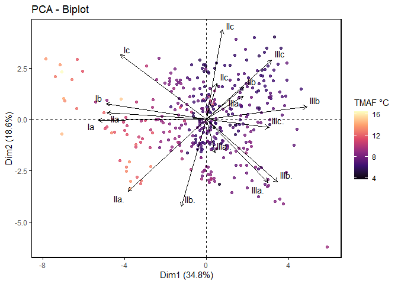<!-- -->

``` r
#Plot with age as shading
ages_full <-
  c(rep(0, each = nrow(gdgts_modern_sub)), gdgts_stack$Age_b2k)
plot_PCA5 <-
  fviz_pca_biplot(
    X = brGDGTs_pca,
    repel = TRUE,
    label = "var",
    col.ind = ages_full,
    geom.ind = "point",
    alpha.ind = 0.8,
    col.var = "black"
  )   + scale_shape_manual(values = c(21, 22, 23, 24)) +  theme(
    panel.grid.major = element_blank(),
    panel.grid.minor = element_blank(),
    panel.border = element_rect(
      colour = "black",
      fill = NA,
      size = 1
    )
  ) + scale_color_continuous(type = "viridis") + labs(color = "Age_b2k")
plot_PCA5
```

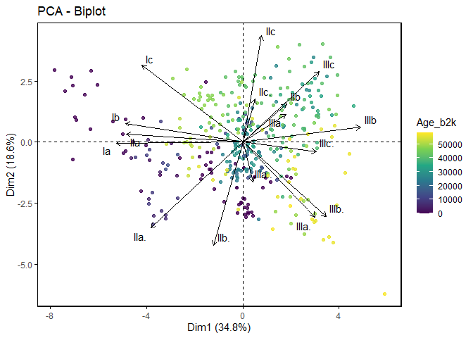<!-- -->

``` r
#plot with fIIIa''iso as shading
fIIIa..full <- c(gdgts_modern_sub$fIIIa.., gdgts_stack$fIIIa..)
plot_PCA6 <-
  fviz_pca_biplot(
    X = brGDGTs_pca,
    repel = TRUE,
    label = "var",
    col.ind = fIIIa..full,
    geom.ind = "point",
    alpha.ind = 0.8,
    col.var = "black"
  ) + scale_shape_manual(values = c(21, 22, 23, 24)) +  theme(
    panel.grid.major = element_blank(),
    panel.grid.minor = element_blank(),
    panel.border = element_rect(
      colour = "black",
      fill = NA,
      size = 1
    )
  ) + scale_color_continuous(type = "viridis") + labs(color = "fIIIa''")
plot_PCA6
```

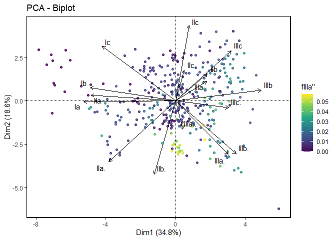<!-- -->

``` r
grid.arrange(plot_PCA2, plot_PCA3, plot_PCA4, plot_PCA3b, nrow = 2)
```

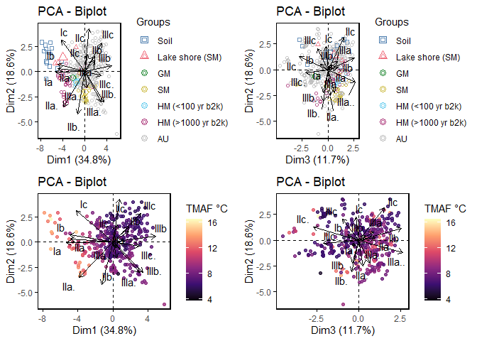<!-- -->

``` r
### Raberg22 pca
Raberg22_reduced <-
  Raberg_22 %>% filter(Sample.group != "Bone", Sample.group != "Groundwater")
Raberg22_reduced_sample_group <- Raberg22_reduced$Sample.group
Raberg22_reduced <- Raberg22_reduced[, 21:35]
brGDGTs_data_reduced <- brGDGTs_data[, -3]

# Remove "f" from column names in Raberg22
names(Raberg22_reduced) <- sub("^f", "", names(Raberg22_reduced))

# Reorder columns in Raberg22
Raberg22_reduced <-
  Raberg22_reduced[, colnames(brGDGTs_data_reduced)]

# Perform rbind after aligning the columns
Raberg22_plus_ELSA <- rbind(Raberg22_reduced, brGDGTs_data_reduced)

Raberg22_pca <- prcomp(clr(Raberg22_plus_ELSA), scale = TRUE)

sample_groups_Raberg22_plus_ELSA <-
  c(Raberg22_reduced_sample_group,
    as.character(sample_type_full_alt2))

plot_PCA7 <-
  fviz_pca_biplot(
    X = Raberg22_pca,
    repel = TRUE,
    label = "var",
    habillage = as.factor(sample_groups_Raberg22_plus_ELSA),
    geom.ind = "point",
    alpha.ind = 0.8,
    col.var = "black"
  )  +    theme(
    panel.grid.major = element_blank(),
    panel.grid.minor = element_blank(),
    panel.border = element_rect(
      colour = "black",
      fill = NA,
      size = 1
    )
  )
plot_PCA7
```

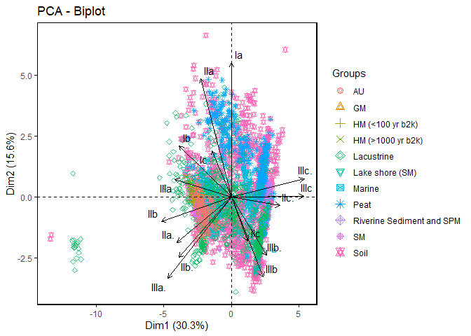<!-- -->

``` r
### BIGMAC dataset PCA
big_mac_data <- read.csv("./BIGMaC-main/BIGMaC_GDGTs_Zenodo.csv")
big_mac_brGDGTS <- big_mac_data[, 17:29]
big_mac_brGDGTS <-
  big_mac_brGDGTS[big_mac_data$Curated.Cluster != "Peat-type", ]
colnames(big_mac_brGDGTS) <-
  c(
    "IIIa",
    "IIIa.",
    "IIIb",
    "IIIb.",
    "IIa",
    "IIa.",
    "IIb",
    "IIb.",
    "IIc",
    "IIc.",
    "Ia",
    "Ib",
    "Ic"
  )
brGDGTs_data_reduced2 <-
  select(brGDGTs_data_reduced, all_of(colnames(big_mac_brGDGTS)))
big_mac_brGDGTS_plus <-
  rbind(brGDGTs_data_reduced2, big_mac_brGDGTS)
big_mac_brGDGTS_plus <-
  big_mac_brGDGTS_plus / rowSums(big_mac_brGDGTS_plus)
big_mac_sample_type_plus <-
  c(as.character(sample_type_full_alt2),
    big_mac_data[big_mac_data$Curated.Cluster != "Peat-type", ]$Curated.Cluster)
big_mac_sample_type_plus[big_mac_sample_type_plus == "Soil"] <-
  "Eifel-soil"
big_mac_sample_type_plus <-
  factor(big_mac_sample_type_plus, levels = unique(big_mac_sample_type_plus))


big_mac_pca <- prcomp(clr(big_mac_brGDGTS_plus), scale = TRUE)

plot_PCA8 <-
  fviz_pca_biplot(
    X = big_mac_pca,
    repel = TRUE,
    label = "var",
    habillage = as.factor(big_mac_sample_type_plus),
    geom.ind = "point",
    addEllipses = TRUE,
    ellipse.type = "convex",
    alpha.ind = 0.8,
    col.var = "black"
  )  +    theme(
    panel.grid.major = element_blank(),
    panel.grid.minor = element_blank(),
    panel.border = element_rect(
      colour = "black",
      fill = NA,
      size = 1
    )
  ) + scale_shape_manual(values = c(0, 2, 1, 1, 1, 1, 1, 4, 4, 4, 4)) + scale_color_manual(
    values = c(
      "#4477AA",
      "#EE6677",
      "#228833",
      "#CCBB44",
      "#66CCEE",
      "#AA3377",
      "#BBBBBB",
      "#EE8866",
      "#44BB99",
      "#a2cc33cd"
    )
  ) + scale_fill_manual(
    values = c(
      "#4477AA",
      "#EE6677",
      "#228833",
      "#CCBB44",
      "#66CCEE",
      "#AA3377",
      "#BBBBBB",
      "#EE8866",
      "#44BB99",
      "#a2cc33cd"
    )
  )
```

    ## Scale for shape is already present.
    ## Adding another scale for shape, which will replace the existing scale.

``` r
plot_PCA8
```

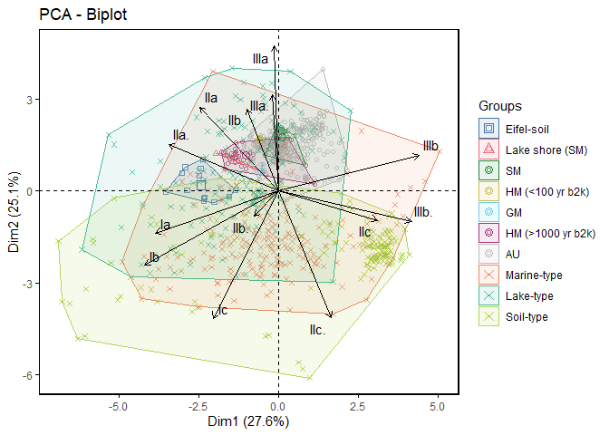<!-- -->

## Boxplot of all brGDGT data

``` r
brGDGTs_piv <-
  cbind(brGDGTs_data, sample_type_full_alt2) %>%  tidyr::pivot_longer(
    cols = colnames(brGDGTs_data),
    names_to = "Compounds",
    values_to = "FA"
  )
colnames(brGDGTs_piv)[1] <- "Sample type"
brGDGTs_piv$facet_group <- 0
brGDGTs_piv <- brGDGTs_piv %>%
  mutate(facet_group = case_when(
    Compounds %in% c("IIIa", "IIIa.", "IIIa..", "IIIb", "IIIb.", "IIIc", "IIIc.") ~ 2,
    Compounds %in% c("Ia", "Ib", "Ic", "IIa", "IIa.", "IIb", "IIb.", "IIc", "IIc.") ~ 1,
    TRUE ~ facet_group
  ))

ggplot(brGDGTs_piv, aes(x = Compounds, y = FA, fill = `Sample type`)) +
  geom_boxplot(position = position_dodge(), outlier.shape = NA) + theme_bw() +
  scale_y_log10() + facet_wrap(~ facet_group, nrow = 2, scales = "free_x") +
  khroma::scale_fill_bright()
```

    ## Warning: Transformation introduced infinite values in continuous y-axis

    ## Warning: Removed 41 rows containing non-finite values (`stat_boxplot()`).

<!-- -->

``` r
ggplot(
  filter(brGDGTs_piv, Compounds == "IIIa.."),
  aes(x = Compounds, y = FA, fill = `Sample type`)
) +
  geom_boxplot(position = position_dodge(), outlier.shape = NA) + theme_bw() +
  khroma::scale_fill_bright()
```

<!-- -->
\# pastclim climate model output (Beyer et al., 2020)

## Correlations with external paleoclimate data

\##Tables of r and p-values for timeseries correlation

    ## [1] "Pearson r"

    ##                  Raberg21 Raberg21_strat BAYMBT_MartinezSosa21
    ## Greenland_temp  0.6329203      0.7079967            0.46826490
    ## NA_SST          0.6624501      0.7031856            0.45894575
    ## EPICA           0.5871755      0.7017006            0.36471471
    ## Greenland_temp1 0.6404065      0.7121163            0.47015308
    ## NA_SST1         0.6821876      0.7164677            0.47959881
    ## EPICA1          0.5887124      0.7097668            0.35574104
    ## Greenland_temp2 0.7181067      0.7683732            0.49871222
    ## NA_SST2         0.6838294      0.7245071            0.46061850
    ## EPICA2          0.6000115      0.7110121            0.35085348
    ## Greenland_temp3 0.2720959      0.3878773            0.02096101
    ## NA_SST3         0.3468511      0.4181136            0.04095097
    ## EPICA3          0.3212573      0.4803751           -0.01399865
    ## Greenland_temp4 0.2925398      0.4307314            0.01119243
    ## NA_SST4         0.3788555      0.4168325            0.03298471
    ## EPICA4          0.2545951      0.4313505           -0.08478288
    ## Greenland_temp5 0.4238219      0.5333455            0.06212795
    ## NA_SST5         0.3441471      0.4415858           -0.01536824
    ## EPICA5          0.2447169      0.4377656           -0.11459885
    ##                 BAYMBT_MartinezSosa21_strat     bin_size
    ## Greenland_temp                  0.544540661          250
    ## NA_SST                          0.513370359          250
    ## EPICA                           0.454947518          250
    ## Greenland_temp1                 0.544906779          500
    ## NA_SST1                         0.522234962          500
    ## EPICA1                          0.442456610          500
    ## Greenland_temp2                 0.602764731         1000
    ## NA_SST2                         0.551469373         1000
    ## EPICA2                          0.461557762         1000
    ## Greenland_temp3                 0.096465631  250_glacial
    ## NA_SST3                         0.064383977  250_glacial
    ## EPICA3                          0.061469933  250_glacial
    ## Greenland_temp4                 0.087764340  500_glacial
    ## NA_SST4                         0.034507598  500_glacial
    ## EPICA4                         -0.006743353  500_glacial
    ## Greenland_temp5                 0.139760541 1000_glacial
    ## NA_SST5                         0.022864890 1000_glacial
    ## EPICA5                         -0.009190137 1000_glacial

    ## [1] "Adjusted p-value"

    ##                    Raberg21 Raberg21_strat BAYMBT_MartinezSosa21
    ## Greenland_temp  0.001269563   0.0001268671            0.01482145
    ## NA_SST          0.004369649   0.0016122628            0.05694161
    ## EPICA           0.011937914   0.0016122628            0.13012718
    ## Greenland_temp1 0.001612263   0.0002678713            0.01576974
    ## NA_SST1         0.007544683   0.0043696491            0.05489108
    ## EPICA1          0.054891082   0.0139747352            0.21700998
    ## Greenland_temp2 0.007544683   0.0016122628            0.07339220
    ## NA_SST2         0.021025864   0.0073654984            0.13356428
    ## EPICA2          0.150412233   0.0319765262            0.46158153
    ## Greenland_temp3 0.073205116   0.0104847089            0.95952395
    ## NA_SST3         0.031976526   0.0097446725            0.89544097
    ## EPICA3          0.085130872   0.0097446725            0.97414756
    ## Greenland_temp4 0.085130872   0.0104847089            0.97414756
    ## NA_SST4         0.091092506   0.0583367525            0.95952395
    ## EPICA4          0.441500895   0.1121315620            0.86784248
    ## Greenland_temp5 0.068983539   0.0118854833            0.89544097
    ## NA_SST5         0.193676716   0.0569416114            0.97414756
    ## EPICA5          0.563499350   0.1121315620            0.86784248
    ##                 BAYMBT_MartinezSosa21_strat     bin_size
    ## Greenland_temp                  0.004218400          250
    ## NA_SST                          0.021833729          250
    ## EPICA                           0.048257465          250
    ## Greenland_temp1                 0.004366723          500
    ## NA_SST1                         0.021833729          500
    ## EPICA1                          0.085130872          500
    ## Greenland_temp2                 0.020284263         1000
    ## NA_SST2                         0.055597316         1000
    ## EPICA2                          0.217009984         1000
    ## Greenland_temp3                 0.601969754  250_glacial
    ## NA_SST3                         0.799627119  250_glacial
    ## EPICA3                          0.857005934  250_glacial
    ## Greenland_temp4                 0.678178698  500_glacial
    ## NA_SST4                         0.951863749  500_glacial
    ## EPICA4                          0.974147565  500_glacial
    ## Greenland_temp5                 0.629721074 1000_glacial
    ## NA_SST5                         0.974147565 1000_glacial
    ## EPICA5                          0.974147565 1000_glacial

## Deviation from Beyer model output

    ## Warning in regularize.values(x, y, ties, missing(ties), na.rm = na.rm):
    ## collapsing to unique 'x' values

    ## Warning in regularize.values(x, y, ties, missing(ties), na.rm = na.rm):
    ## collapsing to unique 'x' values

    ## Warning in regularize.values(x, y, ties, missing(ties), na.rm = na.rm):
    ## collapsing to unique 'x' values

    ## Warning in regularize.values(x, y, ties, missing(ties), na.rm = na.rm):
    ## collapsing to unique 'x' values

    ##                    Raberg21              Raberg21_strat 
    ##                    2.258993                    2.195019 
    ##       BAYMBT_MartinezSosa21 BAYMBT_MartinezSosa21_strat 
    ##                    2.527923                    2.378891 
    ##                     age_b2k                   ELSA_TMAF 
    ##                29621.436128                    0.000000

\##Figure to compare calibration models

<!-- -->

## Summary plot ELSA data

<!-- -->

    ## Warning: Transformation introduced infinite values in continuous y-axis

<!-- --><!-- --><!-- --><!-- --><!-- --><!-- --><!-- --><!-- --><!-- -->

    ## Warning: Removed 150 rows containing missing values (`geom_line()`).

<!-- --><!-- -->

    ## Warning: Use of `XRF$S` is discouraged.
    ## ℹ Use `S` instead.

    ## Warning: Use of `XRF$Fe` is discouraged.
    ## ℹ Use `Fe` instead.

<!-- --><!-- --><!-- --><!-- -->

    ## Scale for y is already present.
    ## Adding another scale for y, which will replace the existing scale.

    ## Warning: Transformation introduced infinite values in continuous y-axis

    ## Scale for y is already present.
    ## Adding another scale for y, which will replace the existing scale.
    ## Scale for y is already present.
    ## Adding another scale for y, which will replace the existing scale.

<!-- -->

## Summary plot climate data

    ## Scale for y is already present.
    ## Adding another scale for y, which will replace the existing scale.
    ## Scale for y is already present.
    ## Adding another scale for y, which will replace the existing scale.

    ## Warning: Removed 3118 rows containing missing values (`geom_line()`).

    ## Warning: Removed 1070 rows containing missing values (`geom_line()`).

    ## Warning: Removed 4070 rows containing missing values (`geom_line()`).

    ## Warning: Removed 991 rows containing missing values (`geom_line()`).

    ## Warning: Removed 280 rows containing missing values (`geom_line()`).
    ## Removed 280 rows containing missing values (`geom_line()`).

    ## Warning: Removed 27 rows containing missing values (`geom_path()`).

<!-- -->

    ## Scale for y is already present.
    ## Adding another scale for y, which will replace the existing scale.

    ## Warning: Removed 280 rows containing missing values (`geom_line()`).

    ## Warning: Removed 3118 rows containing missing values (`geom_line()`).

    ## Scale for y is already present.
    ## Adding another scale for y, which will replace the existing scale.

    ## Warning: Removed 1070 rows containing missing values (`geom_line()`).

    ## Warning: Removed 4070 rows containing missing values (`geom_line()`).

<!-- -->

## Big Mac! (Martinez-sosa 2023)

    ##                  Df Sum Sq Mean Sq F value Pr(>F)    
    ## Curated.Cluster   1  15.00  15.003   76.76 <2e-16 ***
    ## Residuals       305  59.61   0.195                   
    ## ---
    ## Signif. codes:  0 '***' 0.001 '**' 0.01 '*' 0.05 '.' 0.1 ' ' 1

    ##                  Df Sum Sq Mean Sq F value   Pr(>F)    
    ## Curated.Cluster   1  0.552  0.5519    35.4 7.37e-09 ***
    ## Residuals       305  4.756  0.0156                     
    ## ---
    ## Signif. codes:  0 '***' 0.001 '**' 0.01 '*' 0.05 '.' 0.1 ' ' 1

    ## Warning: Removed 1 rows containing non-finite values (`stat_boxplot()`).

<!-- --><!-- --><!-- --><!-- -->

#### Comparing brGDGT temps with Greenland temps

<!-- -->

# Bin correlations with Greenland Temp residuals

<!-- -->

# Warming Events

    ##            X Start_age_b2k End_age_b2k Raberg21_strat count     warming
    ## 1  Early_hol         11700        8326      11.704507    10  3.52836321
    ## 2       GI-1         14692       12896       9.906637     9  2.82510867
    ## 3       GI-2         23340       22400       9.973685     2  3.82513192
    ## 4       GI-3         27780       27540       6.338628     2 -0.22729125
    ## 5       GI-4         28900       28600       6.266835     2 -0.95023612
    ## 6       GI-5         32500       32040       6.443663     3  0.22084671
    ## 7       GI-6         33740       33360       6.594245     2  0.90649266
    ## 8       GI-7         35480       34740       6.495324     2  0.07092543
    ## 9       GI-8         38220       36580       7.816099     6  1.04811617
    ## 10      GI-9         40160       39900       6.269333     8  0.04220264
    ## 11     GI-10         41460       40800       6.475389     6  0.20717860
    ## 12     GI-11         43340       42240       6.700255     6 -0.75263569
    ## 13     GI-12         46860       44280       7.197970     7 -0.73620492
    ## 14     GI-13         49280       48340       8.039068    12  0.18246596
    ## 15     GI-14         54220       49600       8.750876    19  0.69595728
    ## 17     GI-15         55800       55400       8.375892     5  0.13943800
    ## 18     GI-16         58280       56500       8.033822     5  0.11704422
    ##    stad_count greenland_temp greenland_warming
    ## 1           2      -28.85556        15.1582329
    ## 2          17      -37.96771         7.3529621
    ## 3          25      -44.65870         3.1908539
    ## 4           9      -41.23846         7.1243292
    ## 5          23      -40.40000         7.4149068
    ## 6           4      -44.23750         7.0690217
    ## 7           5      -45.42000         3.8175000
    ## 8           7      -40.41190         6.7304681
    ## 9          11      -40.82584         6.8109389
    ## 10          7      -45.75385         1.7517094
    ## 11         16      -41.15294         6.0970588
    ## 12          5      -42.07636         8.0981462
    ## 13         32      -39.36791         6.4860369
    ## 14          1      -42.07111         0.7053595
    ## 15          2      -40.35935         5.9542097
    ## 17         18      -40.48421         6.0703349
    ## 18          1      -41.56477         4.5018939

    ## [1] 11.96462

# LGM vs modern seasonal range

    ## [1] 8.323101 4.043101

    ## [1] 4.292281

    ## [1] 5.759088

<!-- -->

    ## [1] 6.319132

    ## [1] 7.396571

    ## [1] 6.719791

    ## [1] 7.590096

    ## [1] 11.49224

<!-- -->

# Comparing with pastclim model output (Beyer)

    ## Warning: Removed 30 rows containing missing values (`geom_line()`).
    ## Removed 30 rows containing missing values (`geom_line()`).
    ## Removed 30 rows containing missing values (`geom_line()`).

<!-- -->

    ## Warning: Removed 30 rows containing missing values (`geom_line()`).

<!-- -->
\# Session info

``` r
Sys.Date()
```

    ## [1] "2023-12-20"

``` r
sessionInfo()
```

    ## R version 4.3.1 (2023-06-16 ucrt)
    ## Platform: x86_64-w64-mingw32/x64 (64-bit)
    ## Running under: Windows 10 x64 (build 19044)
    ## 
    ## Matrix products: default
    ## 
    ## 
    ## locale:
    ## [1] LC_COLLATE=English_Germany.utf8  LC_CTYPE=English_Germany.utf8   
    ## [3] LC_MONETARY=English_Germany.utf8 LC_NUMERIC=C                    
    ## [5] LC_TIME=English_Germany.utf8    
    ## 
    ## time zone: Europe/Berlin
    ## tzcode source: internal
    ## 
    ## attached base packages:
    ## [1] grid      stats     graphics  grDevices utils     datasets  methods  
    ## [8] base     
    ## 
    ## other attached packages:
    ##  [1] PerformanceAnalytics_2.0.4 xts_0.12.2                
    ##  [3] zoo_1.8-11                 car_3.1-2                 
    ##  [5] carData_3.0-5              RColorBrewer_1.1-3        
    ##  [7] palinsol_1.0               pastclim_1.2.4            
    ##  [9] terra_1.7-29               compositions_2.0-6        
    ## [11] geoChronR_1.1.10           psych_2.2.9               
    ## [13] khroma_1.10.0              gridExtra_2.3             
    ## [15] factoextra_1.0.7           yardstick_1.1.0           
    ## [17] workflowsets_1.0.0         tune_1.0.1                
    ## [19] rsample_1.1.0              recipes_1.0.2             
    ## [21] modeldata_1.1.0            infer_1.0.4               
    ## [23] dials_1.1.0                scales_1.2.1              
    ## [25] broom_1.0.1                tidymodels_1.0.0          
    ## [27] ranger_0.14.1              workflows_1.1.0           
    ## [29] parsnip_1.0.2              ggforce_0.4.1             
    ## [31] tseries_0.10-52            BINCOR_0.2.0              
    ## [33] matrixStats_0.63.0         ggpmisc_0.5.1             
    ## [35] ggpp_0.4.5                 paleoFROG_0.1             
    ## [37] forcats_0.5.2              stringr_1.5.0             
    ## [39] dplyr_1.1.2                purrr_1.0.1               
    ## [41] readr_2.1.4                tidyr_1.3.0               
    ## [43] tibble_3.2.1               tidyverse_1.3.2           
    ## [45] ggplot2_3.4.2              pacman_0.5.1              
    ## 
    ## loaded via a namespace (and not attached):
    ##   [1] spatstat.sparse_3.0-1  fs_1.6.2               bitops_1.0-7          
    ##   [4] lubridate_1.9.2        DiceDesign_1.9         httr_1.4.6            
    ##   [7] doParallel_1.0.17      tools_4.3.1            backports_1.4.1       
    ##  [10] utf8_1.2.3             R6_2.5.1               mgcv_1.8-42           
    ##  [13] lazyeval_0.2.2         withr_2.5.0            sp_1.6-0              
    ##  [16] bayesm_3.1-5           quantreg_5.94          cli_3.6.1             
    ##  [19] spatstat.explore_3.2-1 labeling_0.4.2         robustbase_0.95-1     
    ##  [22] spatstat.data_3.0-1    ggridges_0.5.4         pbapply_1.7-0         
    ##  [25] R.utils_2.12.2         parallelly_1.32.1      attempt_0.3.1         
    ##  [28] maps_3.4.1             readxl_1.4.1           TTR_0.24.3            
    ##  [31] rstudioapi_0.14        generics_0.1.3         lomb_2.1.0            
    ##  [34] spatstat.random_3.1-5  googlesheets4_1.0.1    Matrix_1.5-1          
    ##  [37] fansi_1.0.4            abind_1.4-5            R.methodsS3_1.8.2     
    ##  [40] lifecycle_1.0.3        yaml_2.3.7             promises_1.2.0.1      
    ##  [43] crayon_1.5.2           lattice_0.21-8         haven_2.5.1           
    ##  [46] mapproj_1.2.11         pillar_1.9.0           knitr_1.43            
    ##  [49] boot_1.3-28.1          future.apply_1.9.1     codetools_0.2-19      
    ##  [52] glue_1.6.2             data.table_1.14.8      vctrs_0.6.2           
    ##  [55] png_0.1-8              spam_2.9-1             cellranger_1.1.0      
    ##  [58] gtable_0.3.3           assertthat_0.2.1       gower_1.0.0           
    ##  [61] xfun_0.39              mime_0.12              prodlim_2019.11.13    
    ##  [64] pracma_2.4.2           coda_0.19-4            survival_3.4-0        
    ##  [67] gargle_1.2.1           timeDate_4021.106      dplR_1.7.4            
    ##  [70] signal_0.7-7           iterators_1.0.14       hardhat_1.2.0         
    ##  [73] lava_1.6.10            fields_14.1            ellipsis_0.3.2        
    ##  [76] ipred_0.9-14           nlme_3.1-160           usethis_2.1.6         
    ##  [79] rprojroot_2.0.3        tensorA_0.36.2         rpart_4.1.19          
    ##  [82] colorspace_2.1-0       DBI_1.1.3              nnet_7.3-18           
    ##  [85] mnormt_2.1.1           tidyselect_1.2.0       compiler_4.3.1        
    ##  [88] curl_5.0.0             rvest_1.0.3            rintcal_0.6.0         
    ##  [91] SparseM_1.81           xml2_1.3.3             plotly_4.10.1         
    ##  [94] desc_1.4.2             Bchron_4.7.6           checkmate_2.2.0       
    ##  [97] DEoptimR_1.0-13        quadprog_1.5-8         goftest_1.2-3         
    ## [100] digest_0.6.31          spatstat.utils_3.0-3   rmarkdown_2.21        
    ## [103] htmltools_0.5.5        pkgconfig_2.0.3        jpeg_0.1-10           
    ## [106] lhs_1.1.6              highr_0.10             dbplyr_2.2.1          
    ## [109] fastmap_1.1.1          htmlwidgets_1.6.2      rlang_1.1.1           
    ## [112] quantmod_0.4.20        rbacon_3.1.0           shiny_1.7.2           
    ## [115] farver_2.1.1           jsonlite_1.8.4         config_0.3.1          
    ## [118] R.oo_1.25.0            confintr_0.2.0         magrittr_2.0.3        
    ## [121] polynom_1.4-1          dotCall64_1.0-2        munsell_0.5.0         
    ## [124] GPfit_1.0-8            Rcpp_1.0.10            viridis_0.6.3         
    ## [127] furrr_0.3.1            stringi_1.7.12         MASS_7.3-58.1         
    ## [130] plyr_1.8.8             parallel_4.3.1         listenv_0.8.0         
    ## [133] ggrepel_0.9.3          deldir_1.0-9           astrochron_1.1        
    ## [136] splines_4.3.1          tensor_1.5             hms_1.1.3             
    ## [139] ggpubr_0.6.0           multitaper_1.0-15      spatstat.geom_3.2-1   
    ## [142] ggsignif_0.6.4         reshape2_1.4.4         pkgload_1.3.0         
    ## [145] reprex_2.0.2           XML_3.99-0.14          evaluate_0.21         
    ## [148] golem_0.3.5            modelr_0.1.9           BiocManager_1.30.20   
    ## [151] tzdb_0.4.0             foreach_1.5.2          tweenr_2.0.2          
    ## [154] httpuv_1.6.6           RgoogleMaps_1.4.5.3    MatrixModels_0.5-1    
    ## [157] polyclip_1.10-4        future_1.28.0          xtable_1.8-4          
    ## [160] rstatix_0.7.2          oxcAAR_1.1.1           roxygen2_7.2.1        
    ## [163] later_1.3.1            viridisLite_0.4.2      IDPmisc_1.1.20        
    ## [166] class_7.3-22           googledrive_2.0.0      ggmap_3.0.2.9001      
    ## [169] rEDM_1.14.0            timechange_0.2.0       globals_0.16.1
